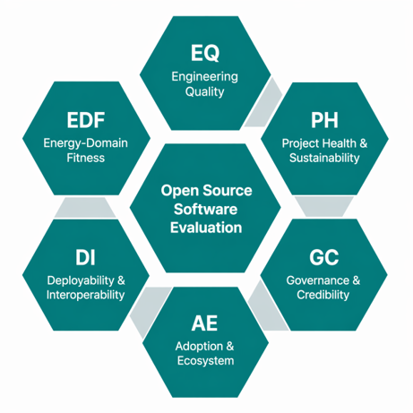

# RECOPS-OSS-Analyzer
**Resilience and Cost Benefits of Open-Source Software in the Power Sector**

## Overview
RECOPS-OSS-Analyzer is a Streamlit-based tool designed to analyze GitHub repositories and extract useful insights. 
The main goal is to study the resilience and cost benefits of open-source software (OSS) within the power sector. 
By providing a GitHub repository URL, the tool performs automated analysis and presents key features in a simple, interactive web interface.

## Live Application
Access the tool directly (no login required): **[RECOPS-OSS-Analyzer on Streamlit](https://recops-oss-analyzer-kth.streamlit.app/)**

## Open Source Software Evaluation Indicators
Our tool evaluates repositories based on a comprehensive set of indicators tailored for the power sector:



*   **EQ:** Engineering Quality
*   **PH:** Project Health & Sustainability
*   **GC:** Governance & Credibility
*   **AE:** Adoption & Ecosystem
*   **DI:** Deployability & Interoperability
*   **EDF:** Energy-Domain Fitness

## Features
*   **Repository Analysis** – Enter any GitHub repo URL and extract structured insights.
*   **Feature Extraction** – Automated collection of relevant repository information based on our core indicators.
*   **Streamlit Web App** – User-friendly web interface accessible via cloud or localhost.
*   **OSS in Power Sector** – Focused on understanding the resilience and cost benefits of OSS adoption.

## Installation & Setup
To run this project locally, follow the step-by-step instructions in the `SETUP.md` file. 
This covers:
1. Installing prerequisites (Miniconda, Git)
2. Creating and activating the Conda environment
3. Running the Streamlit app locally

## Usage (Local)
1. Start the Streamlit app: `streamlit run recops_app.py`
2. Open the browser at `http://localhost:8501`
3. Enter a GitHub repository URL.
4. Click **Start Analysis** to begin feature extraction.


## Project Structure
```text
RECOPS-OSS-Analyzer/
│-- recops_app.py          # Main Streamlit app
│-- environment.yml        # Conda environment specification
│-- SETUP.md               # Step-by-step setup guide
│-- README.md              # Project documentation
│-- indicators.png         # Evaluation indicators graphic

## Motivation
The project is part of ongoing research into evaluating the resilience and cost-effectiveness of OSS adoption in the power sector.
It aims to simplify repository analysis while providing an easy-to-use interface for researchers and practitioners.

## Contributing
Contributions are welcome!
- Fork the repo
- Create a feature branch
- Submit a pull request

## License
This project is released under the MIT License.
